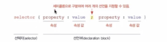

# 0431. 멋사 TIL

 
 

## **[CSS]**

CSS(Cascading Style Sheet) : 웹 사이트의 스타일을 지정하기 위한 언어

 
<small> &nbsp; &nbsp; &nbsp; &nbsp; &nbsp; &nbsp; &nbsp; &nbsp; &nbsp; &nbsp; &nbsp; &nbsp; &nbsp; &nbsp; &nbsp; &nbsp; &nbsp;css기본문법</small>
 
 

## **[HTML]**

<ul>
  <li>
    <h3>&lt;source&gt;</h3>
    <ol>
      <li>정의
      
&lt;source&gt; 태그는 &lt;audio&gt; 요소나 &lt;video&gt; 요소, &lt;picture&gt; 요소에서 사용할 수 있는 다중 미디어 자원(multiple media resources)을 정의할 때 사용합니다.

      </li> 
      <li>속성
      <dl>
        <dt>src</dt>
        <dd>&lt;source&gt; 요소가 &lt;audio&gt; 요소나 &lt;video&gt; 요소 내부에 사용될 때 필수 속성으로, 미디어 파일의 URL을 명시함.</dd>
        <dt>srcset</dt>
        <dd>&lt;source&gt; 요소가 &lt;picture&gt; 요소 내부에 사용될 때 필수 속성으로, 각각 다른 환경에서 사용될 이미지의 URL을 명시함.</dd>
        <dt>sizes</dt>
        <dd>각각 다른 페이지 레이아웃에서 사용될 이미지의 크기를 명시함.</dd>
      </dl>
      </li>
    </ol>
  </li>
  <li>
    <h3>video</h3>
    <ol>
    <li>정의
    
HTML &lt;video&gt; 요소는 비디오 플레이백을 지원하는 미디어 플레이어를 문서에 삽입합니다. 오디오 콘텐츠에도 사용할 수 있으나, &lt;audio&gt; (en-US) 요소가 사용자 경험에 좀 더 적합합니다.

    </li>
    <li>속성
    <dl>
      <dt>autoplay</dt>
      <dd>부울 속성(boolean); 해당 속성이 지정된 경우 비디오가 데이터 로드를 완료하기 위해 중지하지 않고 재생할 수 있는 가장 빠른 시점에 재생되기 시작합니다. autoplay를 비활성화시킬 때 autoplay="false"는 동작하지 않습니다. muted 속성과 같이 사용해야 작동</dd>
      <dt>muted</dt>
      <dd>부울 속성(boolean); 설정하면 오디오가 나오지 않습니다.</dd>
    </dl>
    </li>
    </ol>
  </li>
  <li>
    <h3>map</h3>
    <ol>
    <li>정의
    
&lt;area&gt; (en-US) 요소와 함께 이미지 맵(클릭 가능한 링크 영역)을 정의할 때 사용

    </li>
    <li>속성
    <dl>
      <dt>name</dt>
      <dd>맵을 참조할 때 사용할 수 있는 이름. 반드시 존재해야 하고, 값이 비면 안되며, 값에 공백 문자가 포함되어도 안됩니다. name 특성은 문서 내의 모든 <map>에서 유일해야 합니다. id 특성이 존재하는 경우 name과 값이 동일해야 합니다.</dd>
    </dl>
    </li>
    </ol>
  </li>
  <li>
    <h3>area</h3>
    <ol>
    <li>정의
    
<area>태그는 이미지 맵(image-map)에서 하이퍼링크가 연결될 영역을 정의할 때 사용합니다.

    </li>
    <li>속성
    <dl>
      <dt>title</dt>
      <dd>클릭 가능한 영역의 제목 텍스트를 정의. 제목 텍스트는 대부분의 브라우저에서 도구 설명으로 표시됨</dd>
      <dt>coords</dt>
      <dd>영역의 좌표를 명시함.</dd>
      <dt>shape</dt>
      <dd>영역의 모양을 명시함.</dd>
    </dl>
    </li>
    </ol>
  </li>
  <li>
    <blockquote>

      
       
      <map id="image-map">
        <area target="_blank" alt="페이스북" title="페이스북" href="https://www.facebook.com/" coords="15,15,14" shape="circle">
        <area target="_blank" alt="인스타그램" title="인스타그램" href="https://www.instagram.com/" coords="65,15,14" shape="circle">
        <area target="_blank" alt="유튜브" title="유튜브" href="https://www.youtube.com/" coords="115,15,14" shape="circle">
      </map>
    </blockquote>
  </li>
  <li>
    <h3>table</h3>
    <ol>
    <li>정의
    
표 형식의 데이터 정보를 나타냅니다.

    </li>
    <li>하위 요소
    <dl>
      <dt>&lt;caption&gt;</dt>
      <dd>표의 설명 또는 제목을 나타냅니다.</dd>
      <dt>&lt;thead&gt;</dt>
      <dd>테이블의 열의 머리글인 행들의 집합</dd>
      <dt>&lt;colgroup&gt;</dt>
      <dd>테이블 내의 열 그룹을 정의합니다</dd>
      <dt>&lt;col&gt;</dt>
      <dd>상위 요소 colgroup이 나타내는 열 그룹에서 하나 이상의 열을 정의합니다.only valid as a child of a &lt;colgroup&gt; element that has no span attribute defined.</dd>
      <dt>&lt;th&gt;</dt>
      <dd> 테이블 셀 그룹의 헤더로 정의하며 &lt;tr&gt;요소의 하위 요소로 사용될 수 있습니다.</dd>
      <dt>&lt;tbody&gt;</dt>
      <dd>테이블 행 세트(&lt;tr&gt;요소)를 캡슐화하여 테이블의 (기본) 데이터 본문을 구성함을 나타냅니다</dd>
      <dt>&lt;tr&gt;</dt>
      <dd>테이블 행 요소</dd>
      <dt>&lt;td&gt;</dt>
      <dd>테이블 데이터 셀 요소. &lt;tr&gt;요소의 하위 요소로 사용될 수 있습니다.</dd>
      <dt>&lt;tfoot&gt;</dt>
      <dd>표 바닥글 요소.테이블의 열을 요약하는 행들의 집합</dd>
    </dl>
    </li>
    <li>정의
    

    </li>
    <li>속성
    <dl>
      <dt>scope</dt>
      <dd>- 해당 헤더 셀이 관련되는 셀의 종류를 명시</dd>
      <dd>- 일반 웹 브라우저에서는 요소에 scope 속성을 명시해도 아무런 시각적 효과도 나타나지 않지만, 스크린 리더기와 같은 장치에서는 유용하게 사용될 수 있습니다.</dd>
    </dl>
    </li>
    <li>속성값
    <dl>
      <dt>col</dt>
      <dd>해당 셀이 열(column)을 위한 헤더 셀임을 명시함.</dd>
      <dt>row</dt>
      <dd>해당 셀이 행(row)을 위한 헤더 셀임을 명시함.</dd>
      <dt>colgroup</dt>
      <dd>해당 셀이 열의 그룹을 위한 헤더 셀임을 명시함.</dd>
      <dt>rowgroup</dt>
      <dd>해당 셀이 행의 그룹을 위한 헤더 셀임을 명시함.</dd>
    </dl>
    </li>
    <li>❓
    
scope보다 id headers 속성을 사용하는 게 더 복잡한 테이블을 작성할 수 있음.

    </li>
    </ol>
  </li>
  <li>
    <h3>form</h3>
    <ol>
    <li>정의
    
폼 관련 요소는 웹 문서가 서로 상호작용을 할 수 있도록 하는 역할을 담당

    </li>
    <li>요소
    <dl>
      <dt>&lt;feildset&gt;</dt>
      <dd>웹 양식의 여러 컨트롤과 레이블(&lt;label&gt;)을 묶을 때 사용. 묶은 요소들 주변으로 박스 모양의 선을 그려줍니다.</dd>
    </dl>
      <dt>&lt;input&gt;</dt>
      <dd>웹 양식의 여러 컨트롤과 레이블(&lt;label&gt;)을 묶을 때 사용</dd>
      <dd>모든 form태그는 1대1로 대응되는 label태그를 사용해주는 것을 권고.</dd>
      <dd>&lt;label&gt; 을 &lt;input&gt; 요소와 연관시키려면, &lt;input&gt; 에 id 속성을 넣어야합니다. 그런 다음 &lt;label&gt; 에 id 와 같은 값의 for 속성을 넣어야합니다.</dd>
    </dl>
    </li>
    <li>📝메모
    
form 요소의 action속성은 데이터를 받아서 처리할 서버의 주소를 받음.

    
method옵션은 데이터 이동 방식을  get(데이터 가져옴)과 post(보냄), 혹은 둘 다 쓸 수 있음

모든 form태그는 1대1로 대응되는 label태그를 사용해주는 것을 권고.

    </li>
    </ol>
  </li>
  <li>
    <h3>legend</h3>
    <ol>
    <li>정의
    
&lt;legend&gt 태그는 &lt;fieldset&gt 요소의 캡션(caption)을 정의할 때 사용합니다.

    </li>
    </ol>
  </li>
  <li>
    <h3>dialog</h3>
    <ol>
    <li>정의
    
닫을 수 있는 경고, 검사기, 창 등 대화 상자 및 기타 다른 상호작용 가능한 컴포넌트를 나타냅니다.

    </li>
    <li>속성
    <dl>
      <dt>::backdrop</dt>
      <dd>HTMLDialogElement.showModal() (en-US) 메서드를 사용해 활성화한 &lt;dialog&gt; 요소의 뒤에 스타일을 적용할 수 있습니다.</dd>
    </dl>
    </li>
    </ol>
  </li>
</ul>

 

## **[JS]**
- js를 html에 임베디드해서 사용하기
  1. head영역에 &lt;script&gt; 삽입
  2. script에 defer 옵션 || type="module" 속성 넣기
- &lt;noscript&gt;를 사용하여 js를 지원하지 않는 환경에서의 출력화면 입력할 수 있음.