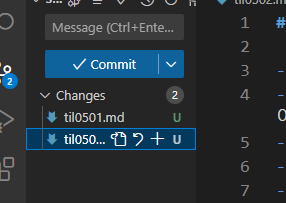

# TIL D+9

## index
- GUI 기능
- 웹폰트를 사용하는 이유
- 클래스 네이밍 방식
- resset css
- margin
- display: flex
- Vendor Prefix
- :root(CSS변수)

1. GUI 기능

- source control 패널 가기
- &#43; 버튼 눌러서 add
- 메시지 쓰고 commit버튼 누르기 
❗  Sync changes는 선생님 저장소에 push하는 것. 하면 안됨

2. 웹폰트를 사용하는 이유
- 방문자의 로컬 컴퓨터에 폰트 설치 여부와 상관 없이 온라인의 특정 서버에 위치한 폰트 파일을 다운로드하여 화면에 표시해주는 웹 전용 폰트이다.
- 로컬폰트 보단 웹폰트를 쓰는게 일관되게 보여줘서 사용성이 편해짐.

3. 클래스 네이밍 방식 (PC / TC, KC, SC/Undersore, CC)
- 파스칼 케이스/타이틀 케이스: 단어 첫글자는 무조건 대문자
- 케밥 케이스: 단어 사이를 하이픈으로 연결 V
- 스네이크 케이스: 단어를 언더바로 연결
- 카멜 케이스: 맨 첫 글자는 소문자 다음 단어 첫 단어를 대문자 V

4. CSS Nomalize / CSS Resset
- 브라우저마다 다른 User Agent Stylesheet를 없애서 동일한 사용자 경험을 제공하기 위한 속성들
  1.  Nomalize: 브라우저의 내장 스타일을 최대한 건들지 않는 선에서 브라우저 간에 상이한 부분만 스타일을 통일
  2.  Resset: 극단적으로 브라우저의 내장 스타일을 초기화 

  -> 큰 규모의 장기 프로젝트는 Resset, 작은 소규모 프로젝트는 nomalize 추천

5. margin
- CSS 속성은 요소의 네 방향 바깥 여백 영역을 설정합니다. margin-top, margin-right, margin-bottom, margin-left의 단축 속성입니다.
- 겹치는 위, 아래 margin은 병합된다.(큰 거 기준으로 먹힘.)
- <code>margin-left: auto;</code>,<code>margin-right: auto;</code>으로 콘텐츠를 가운데 정렬할 수 있음. 
- 역영의 width값이 설정되어 있어야 가능함.
- display: flex;속성을 사용하면 자동으로 부모태그(flex container)에 width값이 auto로 설정되기 때문에 따로 값을 주지 않아도 좌우정렬 됨.
  <blockquote>
  <h3>margin으로 보는 전역 값</h3>
    <code>margin: inherit;</code> 부모요소의 margin속성값을 물려받음  
    <code>margin: initial;</code> 해당 속성을 기본값으로 초기화 
    <code>margin: unset</code> 부모태그에 속성값이 있다면 상속, 없다면 초기값;
  </blockquote>

6. display: flex;
  - 영역의 레이아웃을 flex box로 설정
  - 부모(container)속성
    - <code>flex-wrap</code> :
      + wap-reverse
    - <code>flex-direction</code> :
      + column-reverse, row-reverse
    - <code>flex-flow</code> 
      + flex-direction과 flex-wrap의 값을 각각 받아 한 번에 쓸 수 있는 속성(숏핸드) 
      + display: flex;의 기본 속성은 flex-flow: row no-wrap;이지만 명시적으로 한 번 더 속성을 써주길 권장.
    - <code>justify-content</code>
    - <code>align-items</code>
    - <code>align-content</code>
      + 줄 단위로 세로 간격 조정
  - 자식(item) 속성
    - <code>order</code> :
      + 컨테이너 안에서 현재 요소의 배치 순서를 지정

1. Vender Prefix
- 비표준 CSS 속성과 JavaScript API의 브라우저별 접두사
- 브라우저별 CSS접두사
  <ul>
    <li>-webkit- (Chrome, Safari, 최신 버전의 Opera 및 Edge, 거의 모든 iOS 브라우저(iOS용 Firefox), 기본적으로 모든 WebKit 및 Chromium 기반 브라우저)</li>
    <li>-moz- (Firefox)</li>
    <li>-o- (WebKit 이전의 오래된 Opera 버전)</li>
    <li>-ms- (인터넷 익스플로러 및 Chromium 이전 Microsoft Edge)</li>
  </ul>

1. :root
- 의사 클래스이며 문서 트리의 루트 요소의 선택자
- 전역 CSS변수를 선언할 수 있음
+ 변수 선언 방법
   1. :root선택자의 선언부에 더블 대쉬<code>--</code>로 시작하는 변수를 선언하고 값입력.
   2. 저장된 변수의 값을 사용할 속성의 값 부분에 <code>var(변수)</code>입력
   3. 변수의 값을 가져오지 못할 경우를 대비해 <code>,대체 값</code>을 넣어줌

<h2>learned</h2>
- vscode에서 GUI방식으로 github 저장소에 관리하는 법 학습 
- margin의 원리를 이해 
- flex box를 복습하고 부모 속성과 값을 꼼꼼히 학습했으며 자식 속성인 order을 학습 
- vendor prefix 개념 학습 
- 클래스 네이밍 방식의 개념 학습 

 
