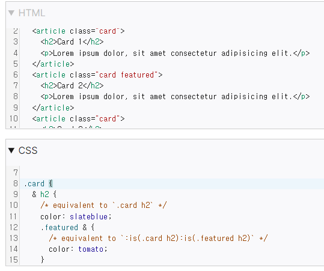

<style>a{color: inherit;}</style>

# TIL D+12

## 📌index
1. HTML&CSS
  - <a href="#1-1">CSS 단위</a>
  - <a href="#1-2">박스모델</a>
   - <a href="#1-3">CSS 논리적 속성과 값</a>
   - <a href="#1-1">중첩 속성</a>
2.  회고
   - <a href="#2-1">Learned</a>
   - <a href="#2-2">Liked</a>
   - <a href="#2-3">Lacked</a>
  <hr>

  <h3 id="1-1">CSS 단위</h3>
  CSS의 길이 `&lt;length&gt;` 단위는 절대 단위와 상대 단위 2가지가 있음.
 1.   #### 절대 단위
   - 화면 출력이 아닌 인쇄에 사용될 때 더 유용함. 일반적으로 px (픽셀) 값을 제외한 단위는 잘 사용되지 않음.
 2. #### 상대 단위
  - 부모요소의 크기나 viewport크기에 따라 달라지는 단위
   ``` - em : 요소 혹은 요소에 상속받은 글꼴 크기
  - rem : 루트 요소의 글꼴 크기
  - vw : 뷰포트의 초기 컨테이닝 블록 너비 1%
  - vh : 뷰포트의 초기 컨테이닝 블록 높이 1%
  ```
  


  <hr>

 <h3 id="1-2">박스모델</h3>
  1. box-sizing속성
  요소의 너비와 높이를 계산하는 방법을 지정하는 속성
```
- content-box(초기값) : CSS 박스 크기 결정법을 사용하며 border와 padding이 100%이후로 추가로 더해짐
- border-box : 테두리와 안쪽 여백의 크기도 요소의 크기로 고려하여 요소의 크기가 부모요소를 넘어가면 자동으로 너비가 조정됨.
```

2. 속성 선택자
태그의 속성에 따른 선택자로 `요소[속성]`의 형태로 씀.
- `[attr]` : 특정 속성을 가지고 있는 요소를 모두 선택
- `[attr="val"]` : 특정 속성을 가지고 있으며, 해당 속성의 속성값까지 일치하는 요소를 모두 선택

- `E[attr]` : E 요소 중 'attr' 속성이 포함된 요소 선택 
<br>
- `E[attr="val"]` : E 요소 중 'attr' 속성의 값이 <mark>정확하게 'val'과 일치</mark>하는 요소 선택
- `E[attr~="val"]` : E 요소 중 'attr' 속성의 값에 'val'이(공백으로 구분) <mark>포함</mark>되는 요소 선택
- `E[attr^="val"]` : E 요소 중 'attr' 속성의 값이 'val'으로 <mark>시작</mark>하는 요소 선택
- `E[attr$="val"]` : E 요소 중 'attr' 속성의 값이 'val'으로 <mark>끝</mark>나는 요소 선택
- `E[attr*="val"]` : E 요소 중 'attr' 속성의 값에 'val'이 <mark>포함</mark>되는 요소 선택


  <hr>

 <h3 id="1-3">CSS 논리적 속성과 값</h3>
  - 물리적 방향이 아닌 논리적 방향 및 차원 매핑을 통해 레이아웃을 제어하는 ​​기능
  - 논리적 속성과 값은 추상적인 용어인 블록 과 인라인을 사용하여 흐름 방향을 설명
  - 물리적 값( top, bottom, left, right) 을 허용하는 속성은 이제 흐름 관련 논리 값( block-start, block-end, inline-start, inline-end)도 허용합니다.
  - ex. `margin-left` -> `margin-inline-start`
  - 일부 속성에는 아직 논리적으로 동등한 속성이 없습니다.
  크기 조정 속성
  - block-size: 일반적 쓰기 방식 (left-to-right)에선 요소의 높이 조정. height속성으로 쓰임(초기값은 auto) 
  - inline-size: 일반적 쓰기(LTR) 방식 에선 요소의 너비 조정. width와 같음

  <hr>

 <h3 id="1-4">중첩 속성(nesting)</h3>
  - 전처리기를 사용하지 않더라도 CSS 중첩을 사용하여 상위 항목의 하위 선택자를 생성할 수 있음
  - Chrome 또는 Safari에서 구현된 2023년 8월 이전의 원래 중첩 사양에는 &중첩 조합자가 필요합니다.
  - 모던 의사 클래스 `:is()`와 유사하게 사용할 수 있음.


```
/* 부모자식 사이 중첩 기본 */
parent {
  /* parent styles */
}
parent child {
  /* child of parent styles */
}

/* 1. 중첩 선택자(&) 없이 */
parent {
  /* parent styles */
  child {
    /* child of parent styles */
  }
}

/* 2. 중첩 선택자 이용해서 */
parent {
  /* parent styles */
  & child {
    /* child of parent styles */
  }
}


/* 형제 사이 중첩 선택자(+) */
parent1 {
  /* sibling styles1 */
  + parent2 {
    /* sibling styles2 */
  }
}


parent1 {
  /* sibling styles1 */
  & + parent2 {
    /* sibling styles2 */
  }
}

/* 선택한 하위 선택자의 하위 요소에 속성 부여  */
parent {
  /* parent styles */
   child & {
    /* child of parent styles */
  }
}

```


<cite><abbr title="링크 이동">[출처 - mdm](https://developer.mozilla.org/en-US/play)</abbr></cite>


  <hr>

 <h3 id="2-1">Learned</h3>
  - 모던 CSS인 중첩 속성을 공부하며 :is() 선택자 등을 이해함.
  - CSS의 lenght단위를 공부하고 em단위를 쓸 때 부모의 속성 값을 상속 받는 구조를 공부함.
  - 속성 선택자를 공부하고 각 선택자의 범위를 비교하며 이해함.
  - 논리적 속성과 필요성의 학습함.
  <hr>

 <h3 id="2-2">Liked</h3>
  - 배운 것들을 mdn등을 찾아보며 이해하고 정리하였음.
  <hr>

 <h3 id="2-3">Lacked</h3>
  - 개념 공부에 너무 많은 시간을 쏟았다. 적은 시간이라도 git, 코테, js등을 매일 공부할 수 있는 루틴을 만들면 좋겠다.