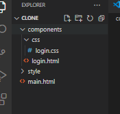
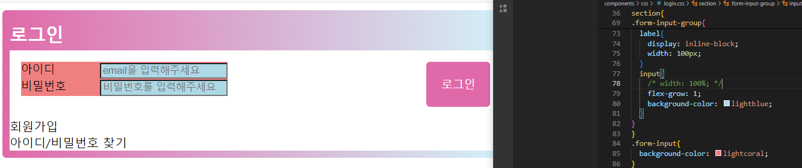
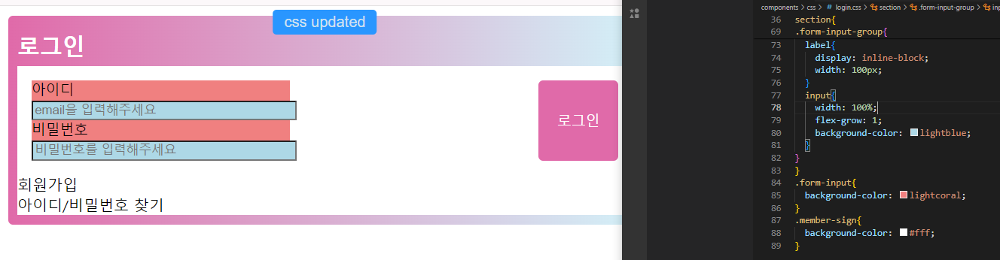
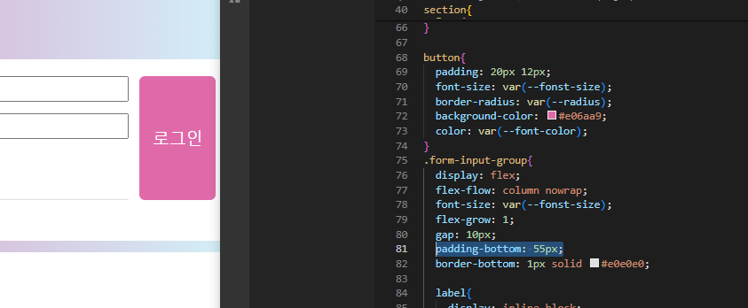
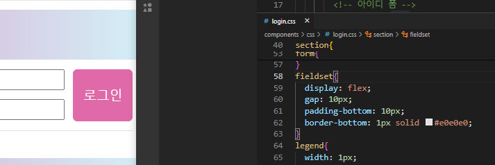
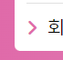
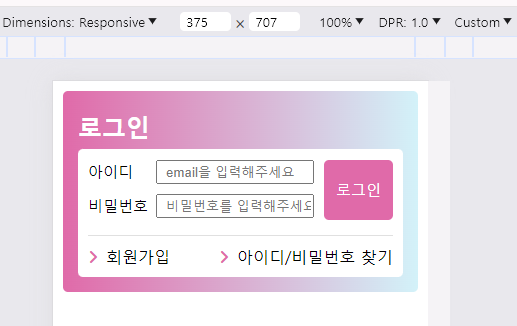
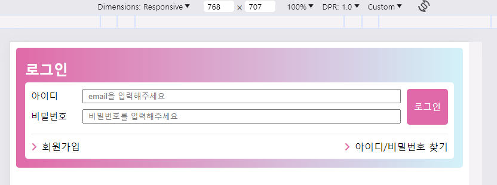

예제 클론 코딩하기
=================

1. 실습용 폴더 만들고 필요한 하위 폴더, 파일 등 생성

2. 우선 기본 docttype 구조에서 로그인 폼 구조 설계하기
```html
  <section class="login">
    <h2>로그인</h2>
    <form action="/">
      <fieldset>
        <legend>로그인 폼 영역</legend>
        <!-- 아이디 폼 -->
        <div>
          <div>
            <label for="userId">아이디</label>
            <input type="email" id="userId" />
          </div>
          <!-- 비밀번호 폼 -->
          <div>
            <label for="userPw">비밀번호</label>
            <input type="password" id="userPw" />
          </div>
        </div>
        <button type="submit">로그인</button>
      </fieldset>
    </form>
    <ul class="member-sign">
      <li><a href=""><span></span>회원가입</a></li>
      <li><a href=""><span></span>아이디/비밀번호 찾기</a></li>
    </ul>
  </section>
  
  ```
  > 고치기: 기본적인 구조는 생성했으나 더 작게 컴포넌트화 할 수 있는 아이디, 비밀번호 입력서식에 group을 넣기.   
  > input에 require상태 부여하기 (이걸해야 값을 안넣고 로그인 버튼을 눌렀을 때 오류창이 뜸.)   
  > a링크의 alt속성도 비워두지 말고 일단 슬래쉬 넣어두기

  3. CSS파일 연결하고 기본 속성 지우기

```css
/* 기본 속성 리셋 */
body{
  margin: 0;
}

h2{
  line-height: 1rem;
  
}
fieldset{
  margin: 0;
  padding: 0;
}
ul{
  padding: 0;
  margin: 0;
}
li{
  list-style: none;
}
a{
  text-decoration: none;
  color: black;
}
button{
  border: none;
  background-color: transparent;
  padding: 0;
}


```
> 우선 현재 쓰고 있는 것만...

4. 스타일 적용하기(중첩과 함수 사용하기)

- 문제1. input태그에 flex-glow속성이 안먹는다


> flex-glow를 input묶은 div요소에도 넣어보고 아이디, 비번 group을 묶은 전체 div에도 넣어봤는데 바르게 정렬이 안되더라,,,   
> A. label과 input를 묶은 form에 display: flex를 안줘서 input에 width: 100%를 주면 label밑으로 줄바꿈이 되는 거였다.
- 문제2. 왜 button요소 높이가 부모요소에 꽉차는가

>A. 상위 컨테이너에 display: flex;를 적용하면 해당 하위 컨테이너(버튼 포함)가 플렉스 항목이 됩니다. 기본적으로 Flex 항목은 Flex 컨테이너의 교차축을 채우기 위해 늘어납니다. 따라서 패딩이나 기타 요인으로 인해 상위 컨테이너의 높이가 증가하는 경우 명시적으로 달리 스타일을 지정하지 않는 한 플렉스 항목(버튼 포함)도 컨테이너의 높이에 맞게 늘어납니다. 버튼이 상위 컨테이너와 함께 늘어나는 것을 방지하려면 'align-self' 속성을 사용하여 개별 플렉스 항목의 정렬을 제어할 수 있습니다   
>A2.  일단 예시처럼 부모요소 말고 더 상위의 fieldset에 속성을 주는 걸로 수정함.


5. fontawesome 연결해서 웹폰트로 아이콘 넣기

[여기](https://velog.io/@namyeji/Visual-Studio-Code%EC%97%90%EC%84%9C-fontawesome-%EC%82%AC%EC%9A%A9%ED%95%98%EA%B8%B0)   보고 연결했는데 선생님이랑 다르게 script요소로 넣었으나 똑같이 동작은 됨🤷‍♀️

 👍

결과
----



>아쉬운 점
> - input요소에 type, name, reauired 속성 빼먹지 않고 입력하기
> - 아이콘 span태그 스크린 리더기에 읽히지 않도록 aria-hidden="true" 속성 넣기
> - 한 컴포넌트를 구성하는 부모태그에 role="group" 속성을 넣어서 접근성 트리에서 연관이 있는 영역을 표시하기
> - :focus-visible선택자를 사용해서 키보드 탐색으로 포커스를 받을 때도 outline-style을 꾸밀 수 있음